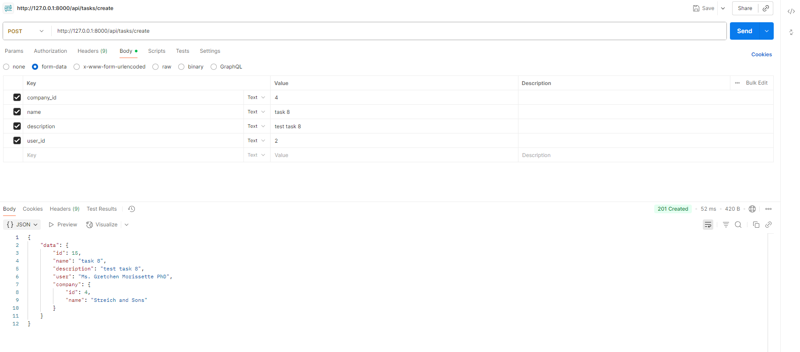

# API de Gestión de Tareas y Compañías

Este proyecto es una API construida con **Laravel**, enfocada en la gestión de tareas asignadas a usuarios dentro de compañías. La API hace uso de recursos como **Form Requests**, **Rules**, y **Resources**.

---

## Características Implementadas

-   [x] Endpoint para **crear tareas** (`POST /tasks/create`)
-   [x] Endpoint para **listar compañías con tareas relacionadas** (`GET /companies`)
-   [x] Validación con **Form Request** y reglas personalizadas (`Rules`)
-   [x] Limitación: un usuario solo puede tener **máximo 5 tareas activas**
-   [x] Respuestas normalizadas mediante **API Resources**
-   [x] Manejo de excepciones en formato **JSON**
-   [x] Seeds y Factories para poblar la base de datos con datos falsos

---

## Stack y herramientas

-   PHP 8.2
-   Laravel 10.x
-   Faker
-   Postman (para pruebas)
-   Laravel Artisan

---

## Validaciones

### Tarea (`POST /tasks/create`)

-   `name`: requerido
-   `description`: requerido
-   `user_id`: requerido, debe existir en DB, no debe tener 5 tareas activas
-   `company_id`: requerido, debe existir en DB

Validaciones personalizadas:

-   Se implementó una **regla custom (`Rule`)** para evitar que un usuario tenga más de 5 tareas activas sin completar (`is_completed = false`)

---

## Ejemplo de Request – Crear tarea

```json
POST /api/tasks/create
{
  "name": "Nueva tarea",
  "description": "Esta es una tarea de prueba",
  "user_id": 1,
  "company_id": 2
}


## Ejemplo de Response – Crear tarea
{
  "data": {
    "id": 7,
    "name": "Nueva tarea",
    "description": "Esta es una tarea de prueba",
    "user": "Juan Pérez",
    "is_completed": false,
    "start_at": "2025-09-24",
    "expired_at": "2025-10-01"
  }
}
```

## Ejemplo de Response – Listado de Compañías

```json
GET /api/companies
{
  "data": [
    {
      "id": 1,
      "name": "Compañía X",
      "tasks": [
        {
          "id": 1,
          "name": "Tarea 1",
          "user": "Juan Pérez",
          "is_completed": false,
          "start_at": "2025-09-24",
          "expired_at": "2025-10-01"
        }
      ]
    }
  ]
}
```

## Capturas de pantalla

### 1. Vista de respuesta al crear una tarea



---

### 2. Vista de listado de compañías con tareas


## Cómo correr el proyecto

# Clonar el repositorio

git clone https://github.com/antonioAstudillo123/API-TASKS.git

# Instalar dependencias

composer install

# Copiar archivo .env

cp .env.example .env

# Generar APP_KEY

php artisan key:generate

# Configurar la base de datos en .env

# Ejecutar migraciones y seeders

php artisan migrate --seed

# Levantar el servidor

php artisan serve

## Autor

Antonio Astudillo
Desarrollador Backend | Laravel & PHP
